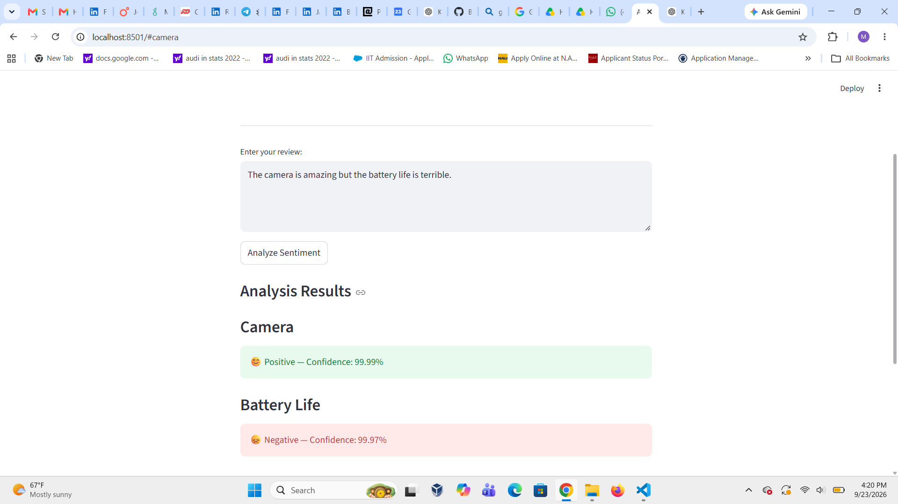
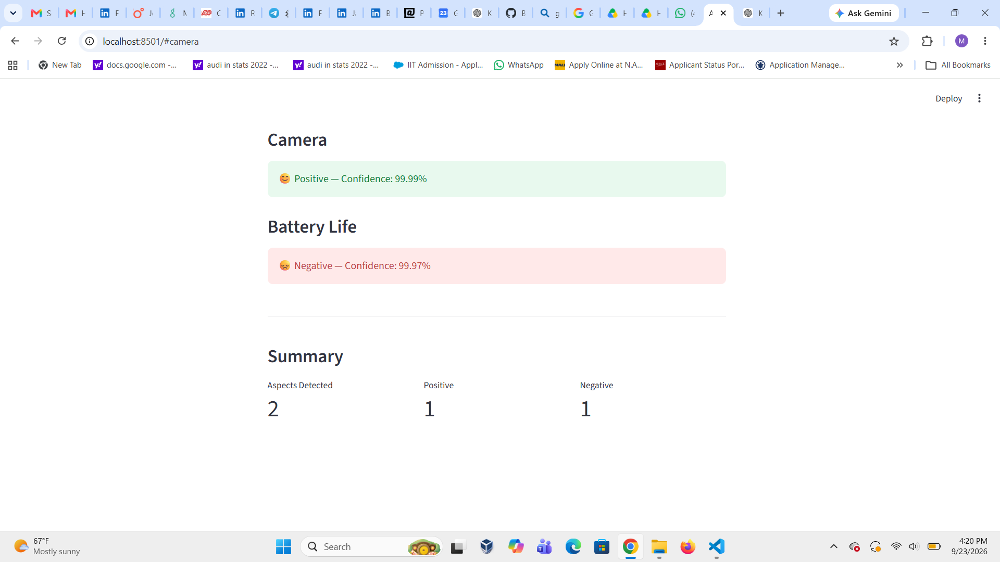

# 🤖 AI Aspect-Based Sentiment Analysis

An AI-powered NLP application that performs **Aspect-Based Sentiment Analysis (ABSA)** on product reviews.

Unlike traditional sentiment analysis, which assigns a single sentiment to an entire review, this application identifies individual product aspects and analyzes the sentiment associated with each aspect separately.
## 🚀 Live Demo

👉 [Try the AI Aspect-Based Sentiment Analysis App](https://ai-aspect-based-sentiment-analysis.streamlit.app)

## 🚀 Features

- Identifies multiple aspects from product reviews
- Performs sentiment analysis separately for each aspect
- Detects positive and negative sentiment
- Displays confidence scores for each prediction
- Handles contrasting opinions in the same review
- Provides a summary of positive and negative aspects
- Interactive web interface built with Streamlit

## 🧠 Example

### Input

> The camera is amazing but the battery life is terrible.

### Output

- Camera → Positive — 99.99%
- Battery Life → Negative — 99.97%
- Aspects Detected → 2
- Positive → 1
- Negative → 1

## 🛠️ Technologies Used

- Python
- Hugging Face Transformers
- DistilBERT
- Natural Language Processing (NLP)
- Aspect-Based Sentiment Analysis (ABSA)
- Streamlit

## 📂 Project Structure

```text
AI_Aspect_Sentiment_Analysis/
│
├── app/
│   ├── app.py
│   └── aspect_sentiment.py
│
├── data/
├── images/
├── results/
├── README.md
└── requirements.txt
```

## ⚙️ How It Works

1. The user enters a product review.
2. The application identifies the product aspects mentioned in the review.
3. The review is separated into relevant clauses.
4. A pretrained sentiment analysis model analyzes each clause.
5. The application displays the sentiment and confidence score for each detected aspect.
6. A summary displays the number of detected, positive, and negative aspects.

## ▶️ How to Run

Clone the repository and install the required dependencies:

```bash
pip install -r requirements.txt
```

Run the Streamlit application:

```bash
python -m streamlit run app/app.py
```

Open the local Streamlit URL displayed in the terminal.

## 📊 Sample Results

The application can analyze reviews containing multiple opinions.

For example:

> The screen is disappointing but the camera quality is excellent.

Results:

- Screen → Negative
- Camera Quality → Positive

Another example:

> The battery life is excellent and the screen is beautiful.

Results:

- Battery Life → Positive
- Screen → Positive

## 🎯 Applications

This project can be useful for:

- Product review analysis
- Customer feedback analysis
- E-commerce review analytics
- Voice-of-customer analysis
- Product improvement insights

## 🔮 Future Improvements

- Automatic aspect extraction using advanced NLP models
- Neutral sentiment classification
- Batch review analysis
- Sentiment visualization
- Exportable analysis reports
- Cloud deployment

## 👩‍💻 Author

**Bhagya Mamidala**

Computer Science | AI/ML | NLP | Generative AI

## 📸 Application Screenshots

### Aspect-Based Sentiment Analysis Results



